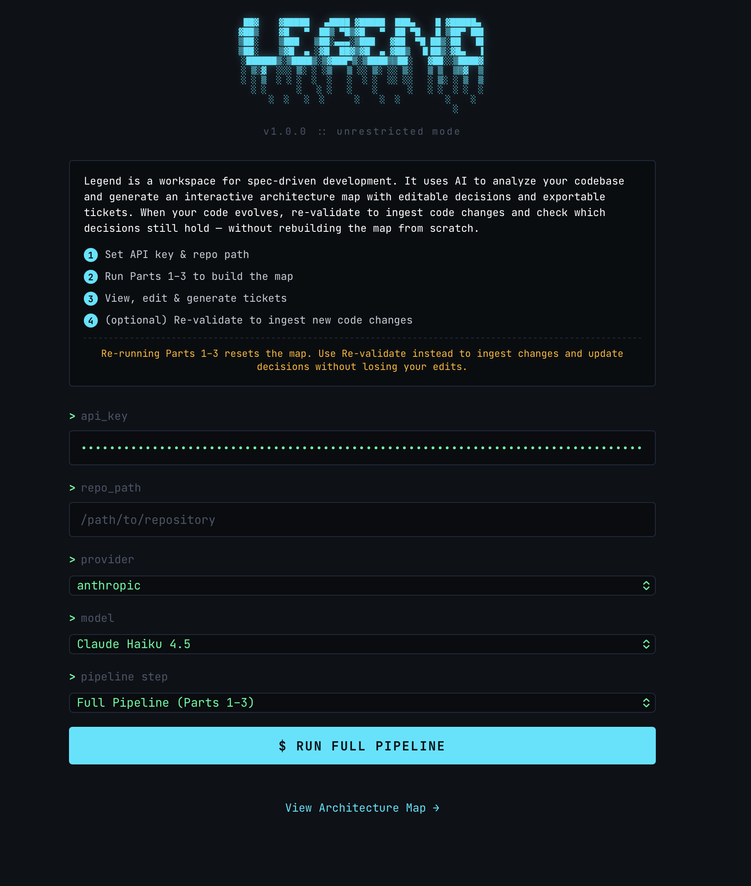
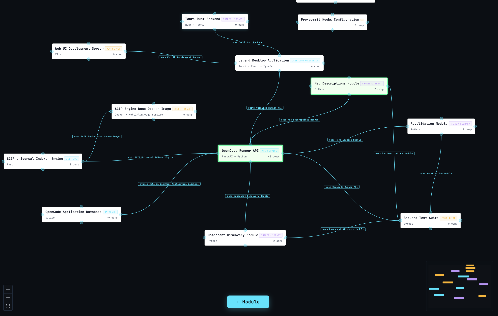
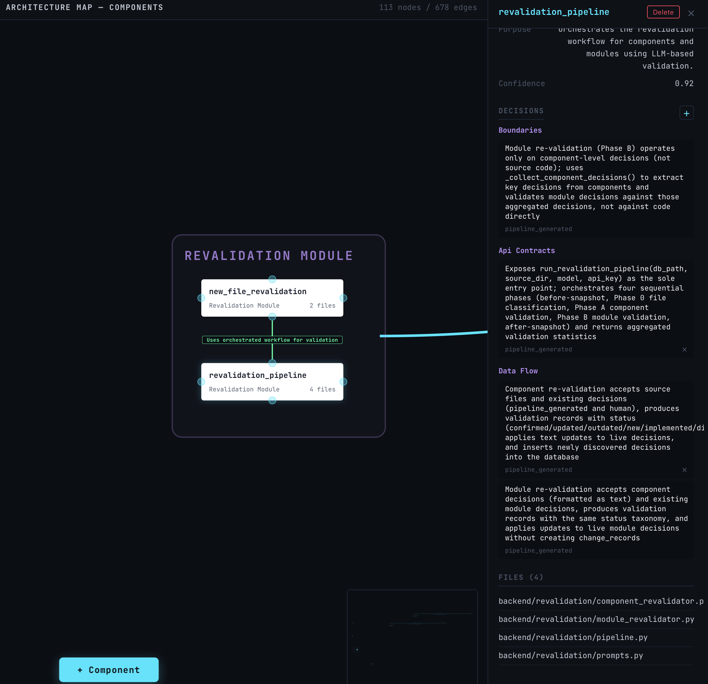
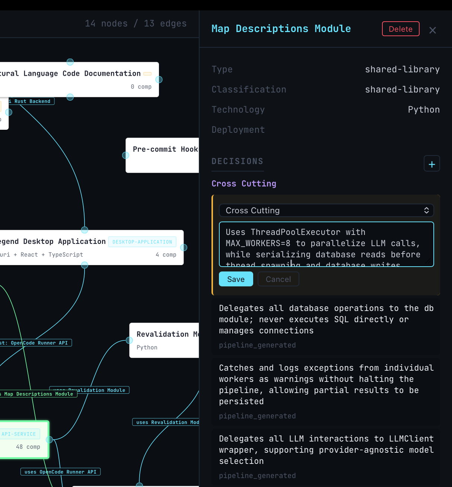
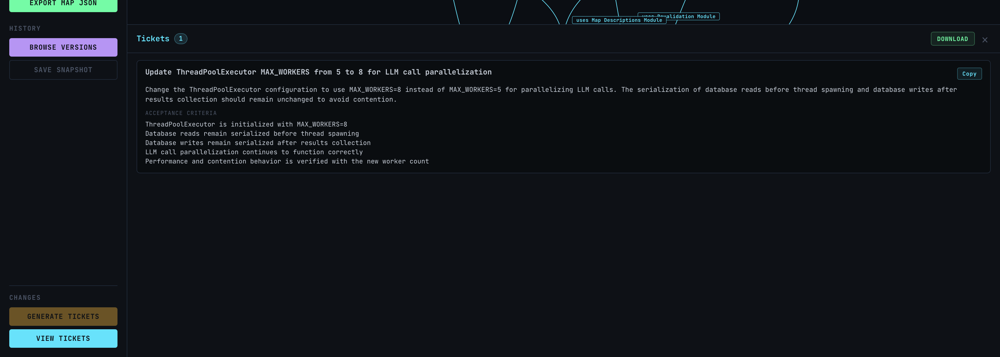

# Legend

Legend automatically generates an architecture map of any codebase. It discovers modules, clusters files into components, and extracts technical decisions — producing a structured, navigable map of how a system is built and why.

The result is a workspace for spec-driven development: a living spec that stays in sync with your code, so teams and AI agents can plan, build, and review against a shared source of truth.

## How It Works

The pipeline runs in stages, with two human review points between them:

1. **Module Discovery (Part 1)** — An AI agent analyzes the codebase and classifies it into C4 Level 2 entities: modules (deployable units), shared libraries, and supporting assets. A second AI pass reads the module list and identifies inter-module dependencies. Both are written to the database.

2. **Component Discovery (Part 2)** — Parses a whole-codebase SCIP index, builds a weighted dependency graph (call, import, inheritance edges), and runs Leiden community detection to find cohesive groups of files (C4 Level 3 components). An LLM refines each cluster — assessing cohesion, splitting where needed, and naming components semantically. Component-to-component edges are aggregated and labeled.

3. **Description Generation (Part 3)** — Reads each component's source code and extracts technical decisions — concrete, falsifiable statements about what the code does and why. Module descriptions are generated bottom-up by elevating cross-cutting patterns from components and adding deployment concerns.

> **Review point:** After Parts 1-3 complete, a human reviews the architecture map in the interactive graph UI before proceeding.

4. **Map Editing** — Humans directly edit the map: add, modify, or remove decisions and components. Every edit creates a change record for traceability. A diff view highlights accumulated changes since the last baseline.

5. **Ticket Generation** — Collects change records since the last baseline, collapses net-deltas, classifies each as a map correction or code change, and generates self-contained implementation tickets. Creates a new baseline after generation.

6. **Re-validation** — After the codebase evolves, re-checks whether existing decisions still match the source code. Detects new untracked files and assigns them to components. Changed decisions get purple highlighting in the UI. Includes full map versioning with browsable snapshots and version comparison.

## Screenshots

### Landing Page
Configure your API key, repository path, provider, and model — then run the pipeline to build your architecture map.



### Architecture Map
Visualize your entire codebase as an interactive node graph showing modules, components, and their relationships.



### Component Detail
Click any node to inspect its purpose, confidence score, decisions, API contracts, data flow, and associated files.



### Decision Editing
Edit architectural decisions directly on the map — changes are tracked through re-validation.



### Generated Tickets
AI-generated tickets based on architectural decisions, ready to copy or download. Paste in the tickets to Linear or directly to claude code



## Tech Stack

- **Backend:** Python (FastAPI), SQLite (one database per analyzed repo)
- **Pipeline:** SCIP indexing (Rust binary or Docker), Leiden clustering (networkx, igraph, leidenalg), protobuf
- **Frontend:** Tauri (Rust), React, Vite, @xyflow/react, d3-force, framer-motion
- **LLM:** Provider-agnostic via litellm (Anthropic, OpenAI, Google, Groq)

## Prerequisites

- Python 3.10+
- Node.js + npm
- Rust + Cargo (for Tauri desktop app and SCIP indexer)
- Docker (optional — for SCIP indexing if not using local indexers)
- An LLM API key (Anthropic, OpenAI, Google, or Groq)

## Getting Started

```bash
./start.sh
```

This sets up the Python venv, installs dependencies, and launches the backend on `:8000` and the Tauri desktop app. On first run it builds the SCIP Docker image (or use `./backend/scip-engine/scripts/install-indexers.sh` to install indexers locally instead).

The launcher UI lets you enter an API key, select a provider/model, point to a repository, and run the full pipeline (Parts 1-3) or individual steps. After the pipeline completes, switch to the map view to explore the architecture.

## Project Structure

```
backend/
  main.py                      # FastAPI server, all API endpoints
  db.py                        # SQLite database (14 tables, all access)
  prompts.py                   # L2 classification prompts
  component_discovery/         # Part 2: SCIP parsing, Leiden clustering, LLM refinement
  map_descriptions/            # Part 3: decision extraction (component + module)
  revalidation/                # Re-validation pipeline + new file classification
  scip-engine/                 # SCIP indexer (Rust binary + Docker)
    legend-indexer/            # Rust orchestrator for language-specific indexers
  tests/                       # Backend test suite
frontend/
  src/
    App.tsx                    # Pipeline launcher (terminal UI)
    api/client.ts              # API client (all fetch wrappers)
    components/graph/          # Map visualization (MapView, DetailPanel, nodes, edges, panels)
    data/                      # Data transform + graph layout (d3-force, hierarchical)
  src-tauri/                   # Tauri desktop wrapper (Rust)
Natural_Language_Code/         # Architecture documentation (source of truth)
start.sh                       # One-command launcher
```

## Documentation

The `Natural_Language_Code/` folder is the project's source of truth. Each feature has an `info_[feature].md` file describing its purpose, workflow, architecture, and implementation. Changes are planned in docs first, then implemented in code.

## License

AGPL-3.0
